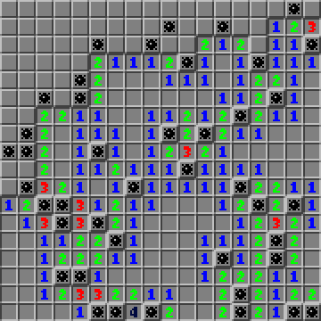

## About
I've always loved Minesweeper, but Windows no longer comes with the game! Sure, there's some recreations online, but I wanted something that felt like the original game while still having some fun with added graphical and sound effects.\
So one night, I decided to see how fast I could whip up a new Minesweeper! I spent around 6 hours making the base game, and then made various tweaks and additions over the next day or two.
With that said, be warned that the code is... not very elegant, and the game may have some issues, especially across different devices. But all of the source code is included, if you're curious.

## How to Play
There's a prebuilt runnable JAR included, so run that and you're good to go! Left click to dig, right click to place a flag. You can move the window by clicking the scroll wheel button and dragging.\
Oh, that's not what you meant by "how to play"? Well, I'm not teaching you how to play Minesweeper, it's really not that hard to understand! And no, you don't click randomly.

